# Analysing_Citation_Networks
This involves exploring the High-energy physics citation network. Arxiv HEP-PH (high energy physics phenomenology) citation graph is from the e-print arXiv. If a paper i cites paper j, the graph contains directed edge from i to j. If a paper cites, or is cited by, a paper outside the dataset, the graph does not contain any information about this. 


# Timeline and Approach

    - Using networkx
    - Used 10000 datapoints rather than full due to system's constraints
    - made the graph network using networkx
    - then tried to draw the nodes with different colors based on their degrees to get the density of the graph at the nodes
    - plotting the graph using matplotlib took a lot of time since the dataset is huge. But for a smaller dataset ot was verified well within a second or two. (smaller dataset of 10000 points, from the original dataset which was picked up randomly)
    - usage of both newman and louvain algos from the python community packages.
    - the terminal outputs for different time slices were taken and plotted with (they are commented as well in this report)
    - date time lib was used for temporal analysis as well 

## I hope you like my work :)


## Reading Task 


### Summary 

#### Introduction and Importance
- The text is all about dealing with networks, specifically in node and link prediction tasks. It emphasizes the importance of informative features for machine learning algorithms and introduces the concept of feature learning in networks. The traditional approach involves hand-engineering features, but the text proposes an alternative method called node2vec.
- The conventional approach involves manually crafting features based on domain expertise, but the text proposes an alternative method called node2vec. This algorithm is characterized as semi-supervised and is designed to learn feature representations for nodes in a network. The optimization process involves a custom graph-based objective function, and stochastic gradient descent is employed for efficiency.

- One key innovation of node2vec lies in its flexible definition of a node's network neighborhood. The algorithm achieves this by implementing biased random walks, allowing for nuanced exploration of diverse neighborhoods. This adaptability enables the algorithm to capture various network structures, including roles and communities, in its learned representations.

- Importantly, node2vec is not confined to node predictions; it extends to edge prediction tasks as well. Experimental results showcase its superior performance compared to state-of-the-art methods in multi-label classification and link prediction. The algorithm is touted for its efficiency, scalability, and robustness in handling perturbations in network data 

#### Existing Frameworks and Advantages of Node2Vec

- Conventional network feature engineering relies on manual crafting based on network properties. The proposed approach automates this process by framing feature extraction as a representation learning problem, eliminating the need for hand-crafted features.

- Classical methods like Breadth-First Sampling (BFS) and Depth-First Sampling (DFS) each have their strengths and limitations. BFS nails the local structures by focusing on immediate neighbors, emphasizing structural equivalence within network clusters. But It falls short when it comes to exploring beyond these close-knit neighbors. On the flip side, DFS takes a broader view of the network, but its struggle lies in capturing dependencies due to limited sample sizes.

- Talking about Node2vec, Unlike prior discussed algos; it turns feature learning into a maximum likelihood optimization. Taking a cue from Skip-gram and giving it a network element, Node2vec adds to. The real gem here is its neighborhood sampling strategy—crafty and flexible. It doesn't stick to the rigid confines of BFS or depth of DFS. Instead, it cumulates two in the form of random walks.

- Search bias parameters, p and q. These allow fine-tune between exploration and exploitation, adapting Node2vec to the nuances of different network structures. The randomized random walks are help in this regard, efficiently sampling the complex structures of network structures. Especially Node2vec doesn't stop at nodes—it extends its prowess to edges, enhancing its link predicition capabilities.

- In terms of scalability too Node2vec flexes its computational muscles, being a champ in both space and time efficiency. Recycling samples across different nodes obviously makes it more efficient. The cumulation of preprocessing, random walk simulations, and SGD optimization certainly exempliefies its contention as a relevant algo.

#### Experimental Results and Conclusion

- The Les Misérables network case study vividly demonstrated Node2vec's capability to unveil clusters based on homophily and structural equivalence simultaneously. It surpassed classical methods like Breadth-First Sampling (BFS) and Depth-First Sampling (DFS) in characterizing different aspects of network relationships.

- Node2vec's scalability was noteworthy imo, effortlessly handling large networks with parallelizable phases, from preprocessing to stochastic gradient descent optimization. This scalability makes it a practical choice for extensive networks.

- In practical tasks such as multi-label classification and link prediction, Node2vec consistently outperformed other feature learning algorithms like DeepWalk and LINE. Its semi-supervised nature allowed it to adapt exploration strategies, leading to substantial improvements in predictive performance. Node2vec exhibited resilience in perturbation scenarios, showcasing its effectiveness in real-world networks with imperfect information.

### Strengths of Paper

- One major strength of the paper lies in Node2vec's adaptive exploration strategy, allowing it to dynamically adjust its sampling parameters (p and q) based on the underlying structure of the network. This flexibility enables Node2vec to effectively balance the qualities of DFS and BFS. It makes Node2Vec highly versatile imo.

- The empirical results demonstrate Node2vec's superior predictive performance compared to other state-of-the-art feature learning algorithms, such as DeepWalk and LINE. In tasks like multi-label classification and link prediction, Node2vec consistently outperforms its counterparts. It can help in complex structures.

- SNode2vec exhibits impressive scalability, handling large networks efficiently through parallelizable preprocessing and optimization phases. Additionally, the algorithm demonstrates robustness in perturbation scenarios, showcasing its ability to perform well even when faced with missing or noisy edges. This i beleive makes it safe for practial use cases.

### Weaknesses

-  One notable weakness of the paper is the i think limited interpretability of the learned representations. While Node2vec excels in capturing complex patterns within networks, providing clear interpretations for the embedding dimensions or explaining the significance of specific parameter choices (p and q) remains not so transparent and less intuitive and kinda challenging.

- I think the reliance on so many parameters makes it sensitive to parameters.The performance of Node2vec is influenced by various parameters, including the dimensions of the feature representations (d), the number of walks per node (r), walk length (l), and neighborhood size (k). The sensitivity to parameter choices necessitates careful tuning, and the paper does not provide extensive guidance on selecting optimal values for these parameters. 

- The paper primarily evaluates Node2vec against a specific set of benchmarks, such as DeepWalk and LINE, focusing on macro-F1 scores and AUC for multi-label classification and link prediction tasks, respectively. While these metrics offer valuable insights, a more comprehensive comparison with a broader set of algorithms and evaluation metrics could provide a more nuanced understanding of Node2vec's strengths and limitations. In my opinion benchmarks where the algo might struggle should also be openly shown.

### Areas of Improvements

- To address the interpretability challenges, the paper could benefit from an in-depth analysis of how specific dimensions in the learned representations correspond to structural properties or node attributes. Providing visualizations or case studies that illustrate the meaning of certain embedding dimensions would enhance the paper's clarity and help users comprehend the practical implications of the learned representations.

-   Include a discussion on best practices for parameter tuning and making the algorithm more robust to variations in these parameters would be valuable.Given the sensitivity of Node2vec to parameter choices, introducing an automated or semi-automated method for parameter tuning would significantly improve the algorithm's usability.

- Extending the comparison with a more diverse set of algorithms, including state-of-the-art methods for network embedding, would enhance the overall evaluation. Showcase the particular weakness or the graphs where it can be inefficient


## Task 1

## Analysis

### Relation of How connected components change over time 
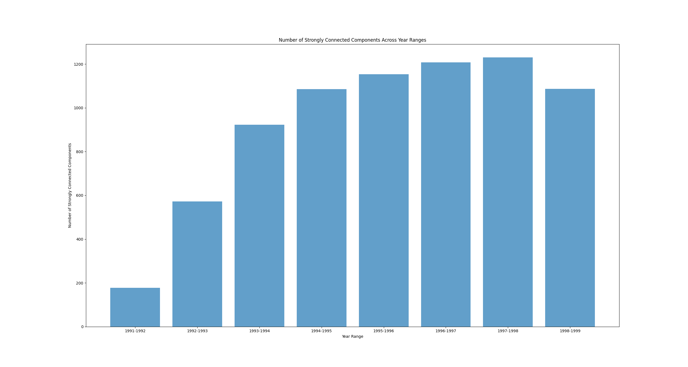

### Relation of How clustering coefficients change over time 
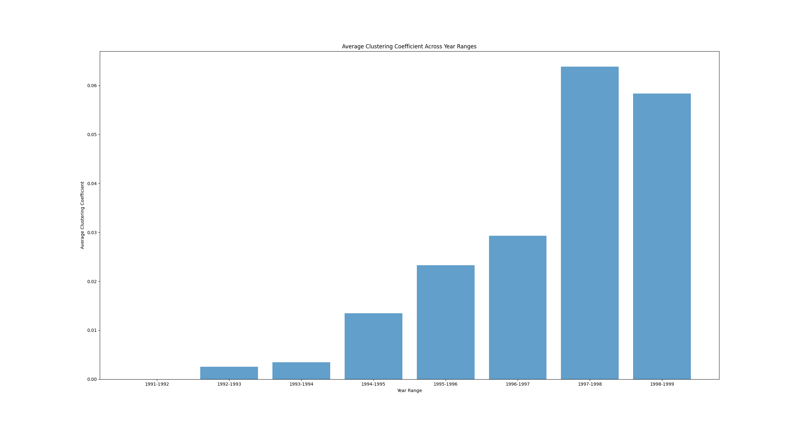

### Relation of How communities change over time 
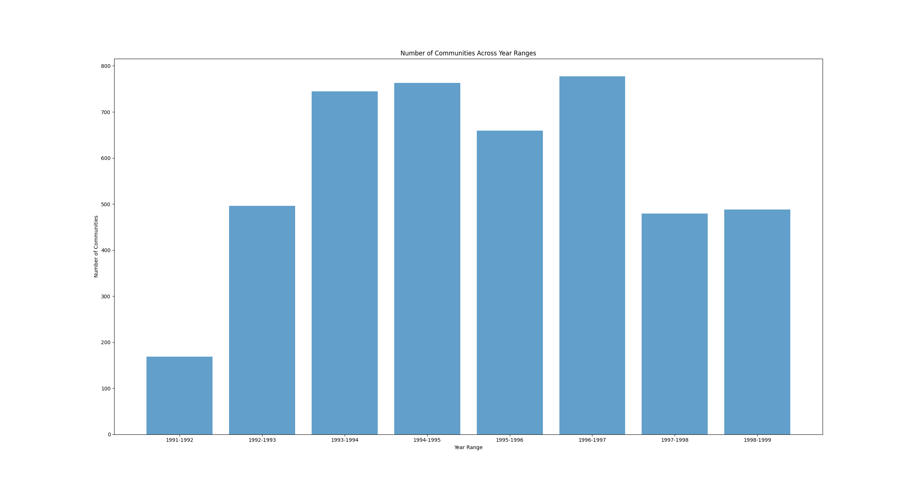


### Average Degree overtime
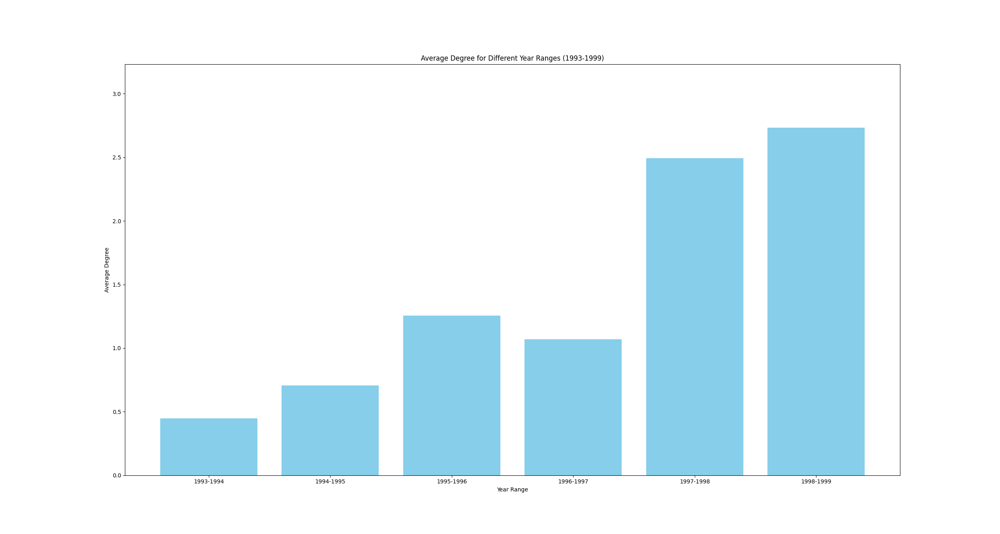

### Degree Coefficients over the Dataset of 10000 samples
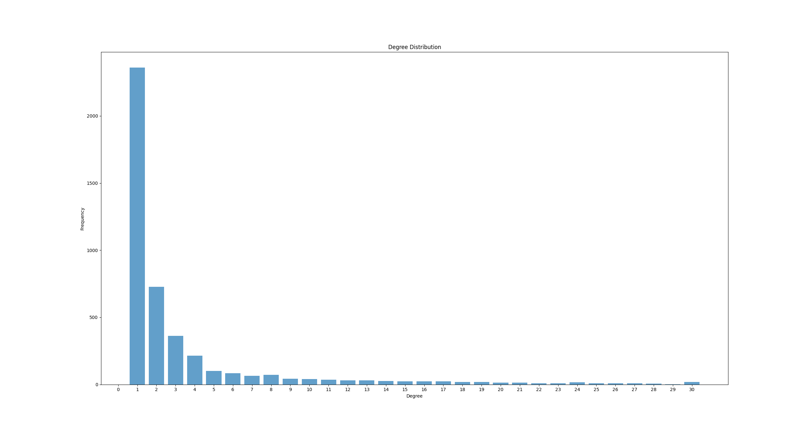

## Interesting Finding 
While all the findings are insightful the 2 which piqued me were how the previous year papers affected the current year's papers in terms of citations and the number of total dependencies 

### How each year papers are dependent on the previous one 
### Number of relations
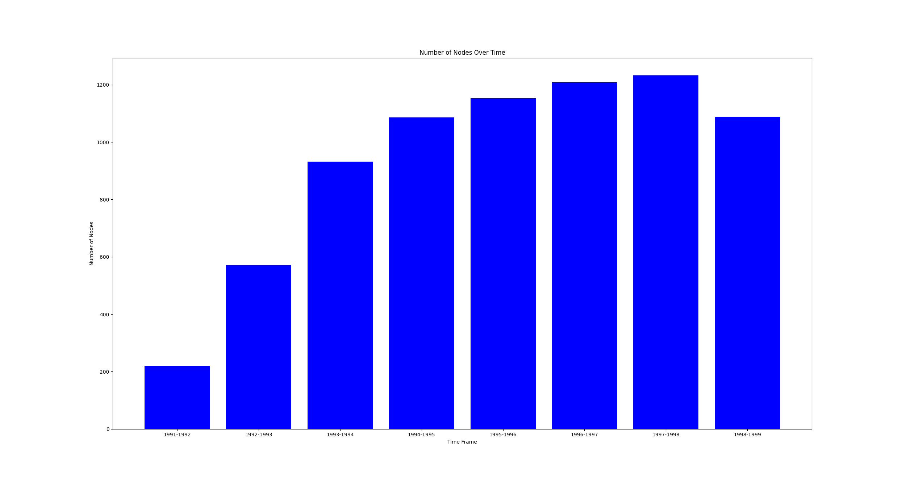

### Number of citations over time 
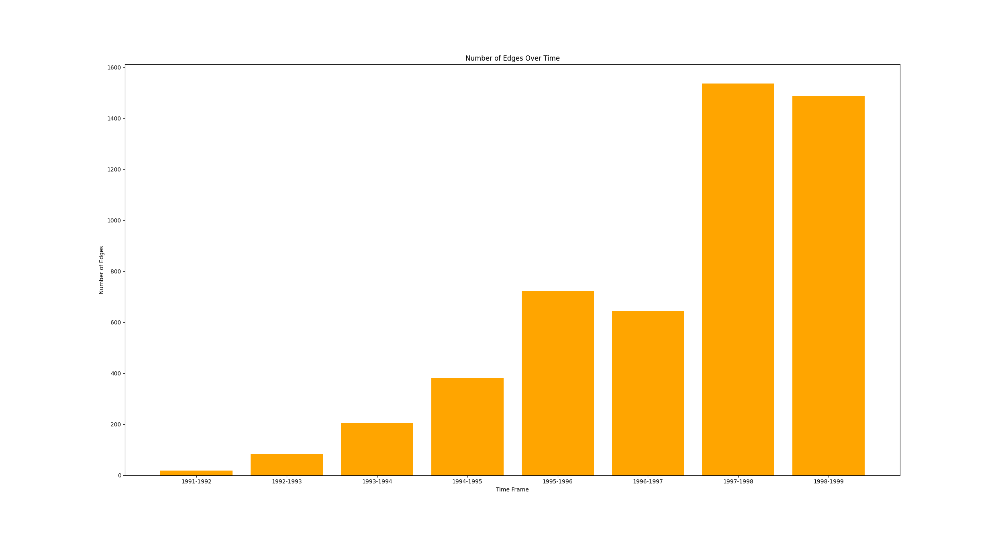

It is clear that the number of citations that is the usage of the previous years papers is growing exponentially as seen here.
This is also exemplified by the bar graph of how connected components evolve over time 


## Task 2

### Analysis

The dissimilarity in community sizes and the proportion of nodes associated with larger communities when employing Girvan-Newman and Louvain community detection algorithms can be traced back to the fundamental principles and methodologies inherent in each algorithm.

Let's start with the Girvan-Newman Algorithm:

Girvan-Newman operates as a hierarchical divisive algorithm, systematically eliminating edges with the highest betweenness centrality. As the process unfolds, the network gradually fragments into smaller communities. Unlike algorithms with a predetermined number of communities, Girvan-Newman adapts until a specific condition, such as achieving a desired number of communities, is met.

The outcome is often a variable number of communities, with a distinctive hierarchy featuring a few prominent communities at the top level. These larger communities can then undergo further subdivision, creating a tree-like structure within the network.

Now, onto the Louvain Algorithm:

Conversely, the Louvain algorithm is rooted in modularity-based principles. It endeavors to maximize the modularity measure, a metric reflecting the quality of community structures. Operating as a greedy algorithm, Louvain seeks to find a partition of the network that optimally enhances the modularity score.

The distinctive trait of the Louvain algorithm is its inclination toward balanced community sizes. By optimizing for modularity, the algorithm penalizes the existence of larger communities. This often results in a partition where individual nodes predominantly belong to single communities. Overall, Louvain has a tendency to generate a larger number of smaller communities in comparison to Girvan-Newman.

In essence, the observed differences in community structures and sizes between Girvan-Newman and Louvain algorithms are deeply rooted in their respective philosophies and optimization criteria. Girvan-Newman, with its hierarchical nature, might yield larger communities at higher levels of the hierarchy. Meanwhile, Louvain, emphasizing modularity, leans towards fostering a more balanced distribution of community sizes.

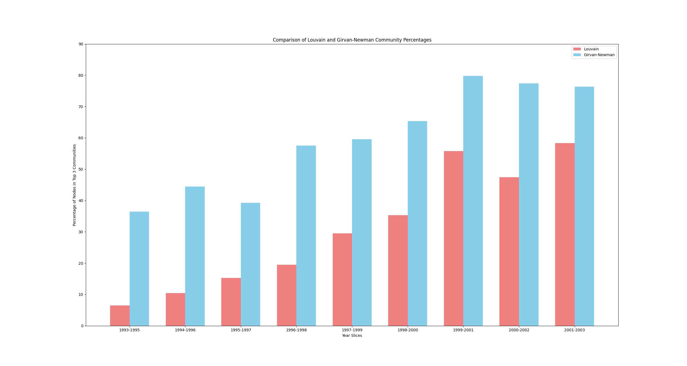


## Louvain ALGO


### Findings

The interesting finding that piqued my curiosity was the fact that as new papers were being published the percentage of them belonging to an already existing large community were increasing by a good chunk.

Looking at the bar graph of percentage of nodes belonging to top3 communities at different time slices

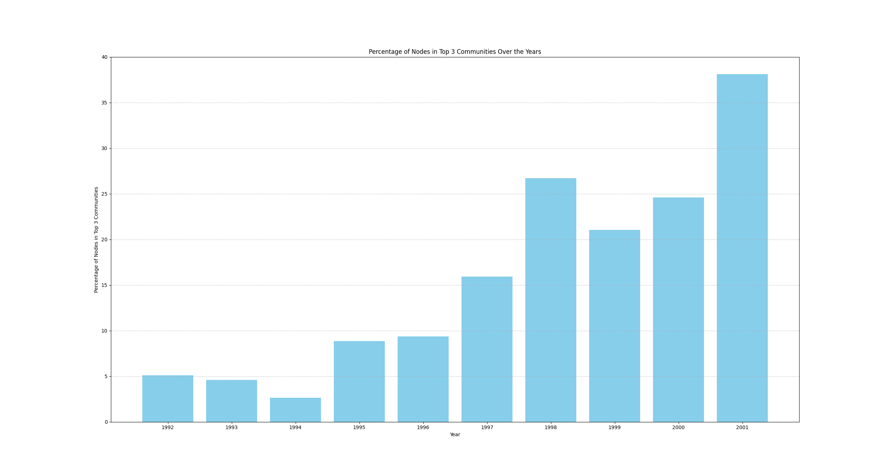

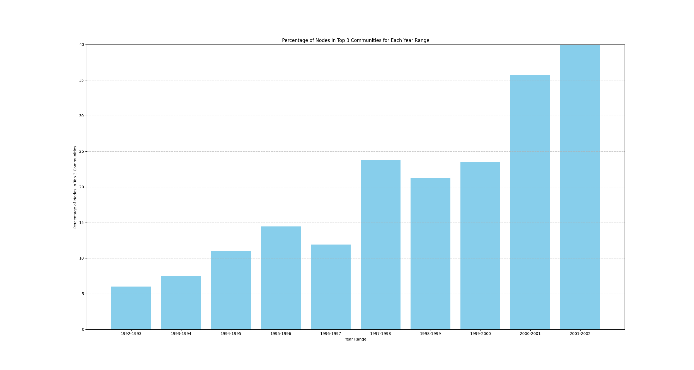


This goes in tandem to my findings in the Task 1 which showed average degree of the nodes increasing.

Some outputs can also exemplify this finding of mine.

## Relatively Older Communities

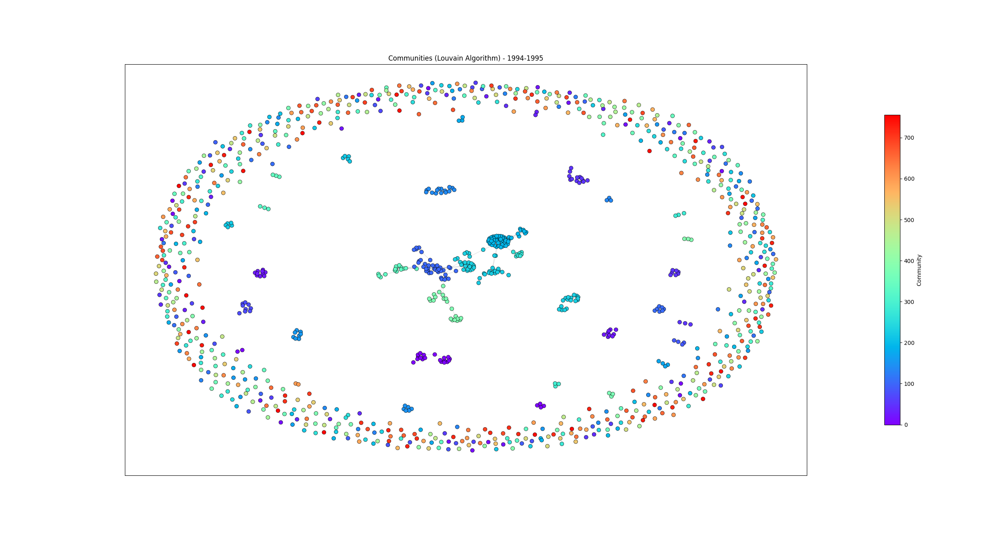

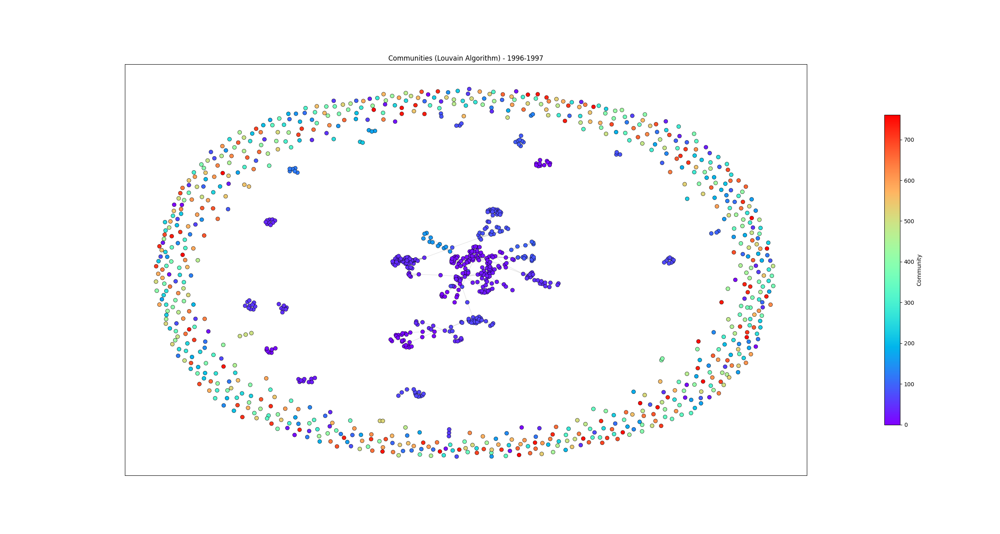

## Relatively Newer Communities

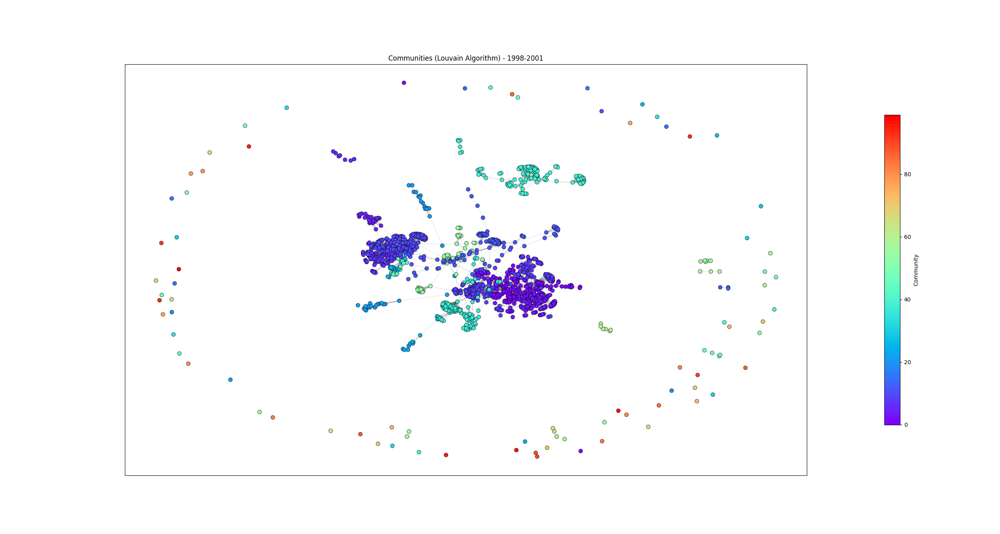

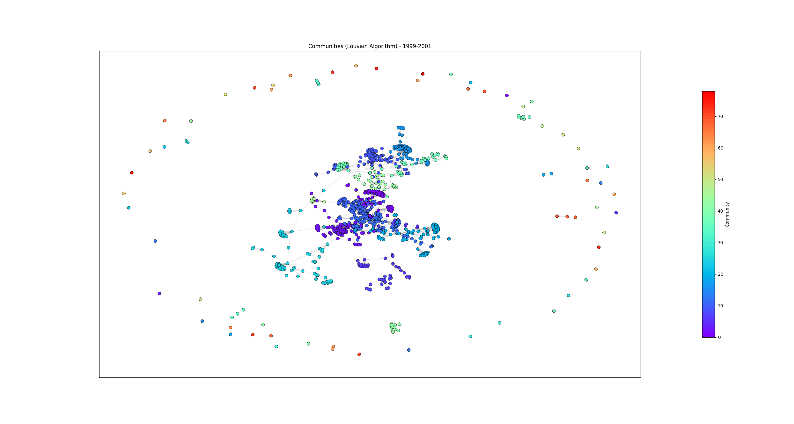

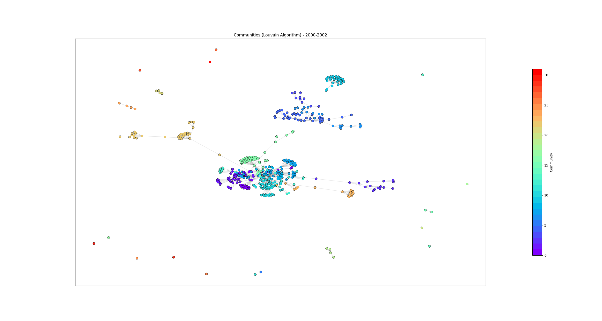

#### The inference we can get is that as the nodes in the middle and the larger communities are increasing and relatively smaller communities at the outskirts are becoming even more sparsely populated...
### The newer papers tend to belong to same popular domain

<!-- 
Community Statistics for 1993-1996:
Total nodes: 2061
Largest community size: 177 (8.59%)
 

Top 3 Community Sizes: [177, 137, 105]
Percentage of Nodes in Top 3 Communities: 20.33%


Community Statistics for 1998-2001:
Total nodes: 1514
Largest community size: 239 (15.79%)
 

Top 3 Community Sizes: [239, 188, 155]
Percentage of Nodes in Top 3 Communities: 38.44%

Total nodes: 568
Largest community size: 12 (2.11%)
 

Top 3 Community Sizes: [12, 11, 11]
Percentage of Nodes in Top 3 Communities: 5.99%

Community Statistics for 1992-1995:
Total nodes: 2274
Largest community size: 120 (5.28%)
 

Top 3 Community Sizes: [120, 116, 115]
Percentage of Nodes in Top 3 Communities: 15.44%

Community Statistics for 1994-1996:
Total nodes: 1669
Largest community size: 99 (5.93%)
Independent nodes: 0 (0.00%)

Top 3 Community Sizes: [99, 90, 69]
Percentage of Nodes in Top 3 Communities: 15.46%

Community Statistics for 1997-1999:
Total nodes: 1668
Largest community size: 175 (10.49%)
Independent nodes: 0 (0.00%)

Top 3 Community Sizes: [175, 106, 104]
Percentage of Nodes in Top 3 Communities: 23.08%

Community Statistics for 2000-2002:
Total nodes: 456
Largest community size: 58 (12.72%)
Independent nodes: 0 (0.00%)

Top 3 Community Sizes: [58, 58, 46]
Percentage of Nodes in Top 3 Communities: 35.53%


Community Statistics for 1992-1993:
Total nodes: 568
Largest community size: 12 (2.11%)
 

Top 3 Community Sizes: [12, 11, 11]
Percentage of Nodes in Top 3 Communities: 5.99%

Community Statistics for 1994-1995:
Total nodes: 1081
Largest community size: 54 (5.00%)
 

Top 3 Community Sizes: [54, 40, 25]
Percentage of Nodes in Top 3 Communities: 11.01%

Community Statistics for 1996-1997:
Total nodes: 1193
Largest community size: 65 (5.45%)
 

Top 3 Community Sizes: [65, 41, 36]
Percentage of Nodes in Top 3 Communities: 11.90%

Community Statistics for 1998-1999:
Total nodes: 1063
Largest community size: 97 (9.13%)
 

Top 3 Community Sizes: [97, 74, 55]
Percentage of Nodes in Top 3 Communities: 21.26%

Community Statistics for 2000-2001:
Total nodes: 451
Largest community size: 59 (13.08%)
 

Top 3 Community Sizes: [59, 58, 44]
Percentage of Nodes in Top 3 Communities: 35.70%


Community Statistics for 1993-1994:
Total nodes: 919
Largest community size: 27 (2.94%)
Top 3 Community Sizes: [27, 23, 19]
Percentage of Nodes in Top 3 Communities: 7.51%

Community Statistics for 1995-1996:
Total nodes: 1142
Largest community size: 62 (5.43%)
Top 3 Community Sizes: [62, 53, 50]
Percentage of Nodes in Top 3 Communities: 14.45%

Community Statistics for 1997-1998:
Total nodes: 1219
Largest community size: 132 (10.83%)
Top 3 Community Sizes: [132, 103, 55]
Percentage of Nodes in Top 3 Communities: 23.79%

Community Statistics for 1999-2000:
Total nodes: 719
Largest community size: 59 (8.21%)
Top 3 Community Sizes: [59, 57, 53]
Percentage of Nodes in Top 3 Communities: 23.50%

Community Statistics for 2001-2002:
Total nodes: 186
Largest community size: 27 (14.52%)

Top 3 Community Sizes: [27, 26, 24]
Percentage of Nodes in Top 3 Communities: 41.40% -->


## Girvan Newman ALGO

As mentioned earlier Girvan Newman tends to make larger communities even larger which is evident by how the percentage of nodes in Top 3 Communties differ with it particular having a larger percentage.

Although the same trend is followed here too that as the nodes in the middle and the larger communities are increasing and relatively smaller communities at the outskirts are becoming even more sparsely populated as time passes...

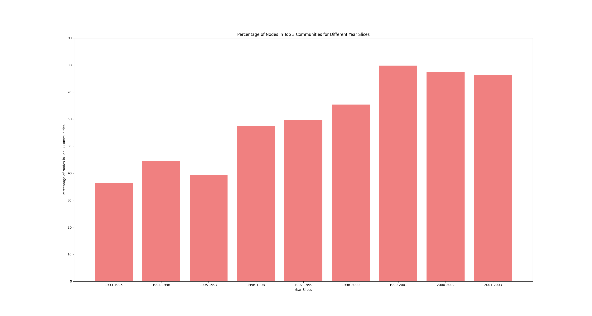

But seems like the increment is not as significant in Newman's algo 

Same trend is being followed here too as per the graphs too...
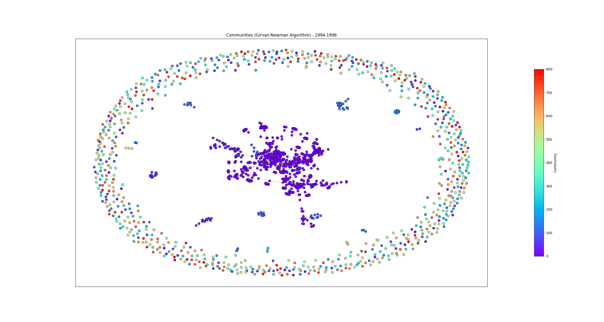

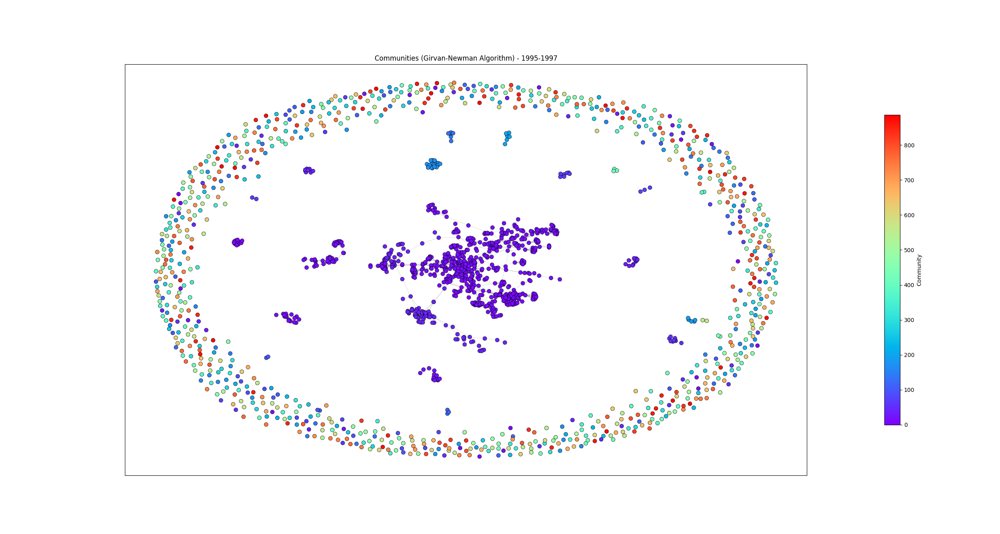

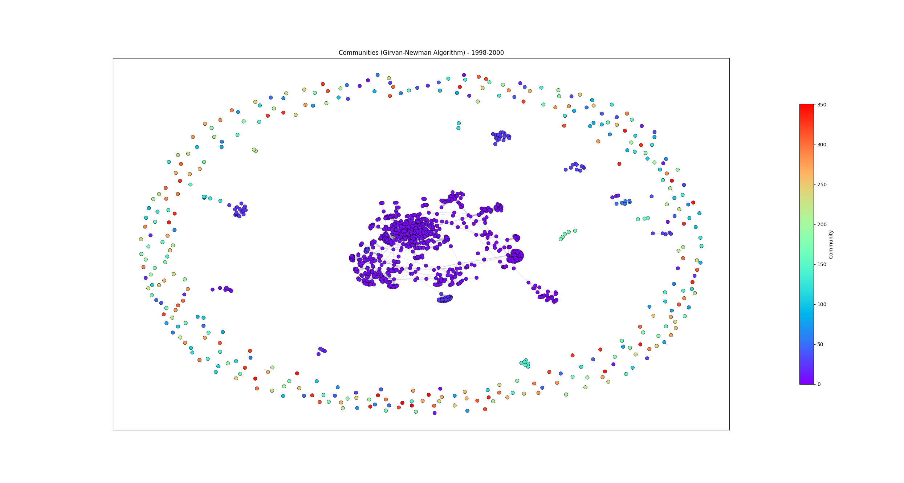


<!-- 
Community Statistics for 1993-1995:
Total nodes: 1473
Largest community size: 275 (18.67%)
Independent nodes: 0 (0.00%)

Top 3 Community Sizes: [275, 158, 104]
Percentage of Nodes in Top 3 Communities: 36.46%

Community Statistics for 1994-1996:
Total nodes: 1669
Largest community size: 481 (28.82%)
Independent nodes: 0 (0.00%)

Top 3 Community Sizes: [481, 195, 66]
Percentage of Nodes in Top 3 Communities: 44.46%

Community Statistics for 1995-1997:
Total nodes: 1747
Largest community size: 468 (26.79%)
Independent nodes: 0 (0.00%)

Top 3 Community Sizes: [468, 129, 89]
Percentage of Nodes in Top 3 Communities: 39.27%

Community Statistics for 1996-1998:
Total nodes: 1807
Largest community size: 627 (34.70%)
Independent nodes: 0 (0.00%)

Top 3 Community Sizes: [627, 285, 127]
Percentage of Nodes in Top 3 Communities: 57.50%

Community Statistics for 1997-1999:
Total nodes: 1668
Largest community size: 498 (29.86%)
Independent nodes: 0 (0.00%)

Top 3 Community Sizes: [498, 426, 69]
Percentage of Nodes in Top 3 Communities: 59.53%

Community Statistics for 1998-2000:
Total nodes: 1333
Largest community size: 410 (30.76%)
Independent nodes: 0 (0.00%)

Top 3 Community Sizes: [410, 278, 183]
Percentage of Nodes in Top 3 Communities: 65.34%

Community Statistics for 1999-2001:
Total nodes: 900
Largest community size: 491 (54.56%)
Independent nodes: 0 (0.00%)

Top 3 Community Sizes: [491, 142, 85]
Percentage of Nodes in Top 3 Communities: 79.78%

Community Statistics for 2000-2002:
Total nodes: 456
Largest community size: 285 (62.50%)
Independent nodes: 0 (0.00%)

Top 3 Community Sizes: [285, 37, 31]
Percentage of Nodes in Top 3 Communities: 77.41%


Community Statistics for 2001-2003:
Total nodes: 186
Largest community size: 103 (55.38%)
Independent nodes: 0 (0.00%)

Top 3 Community Sizes: [103, 23, 16]
Percentage of Nodes in Top 3 Communities: 76.34% -->


# References

```
    FOR PLOTTING:
    https://networkx.org/documentation/stable/auto_examples/drawing/plot_directed.html 

    FOR ANALYSIS: 
    https://www.cs.rice.edu/~nakhleh/COMP571/Slides-Spring2015/GraphTheoreticProperties.pdf 
    https://www.analyticsvidhya.com/blog/2018/04/introduction-to-graph-theory-network-analysis-python-codes/
```

