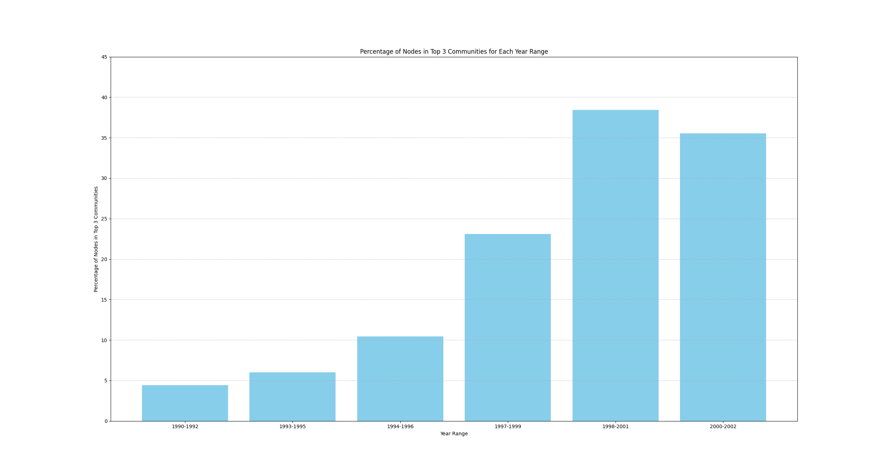

# Analysing_Citation_Networks
This involves exploring the High-energy physics citation network. Arxiv HEP-PH (high energy physics phenomenology) citation graph is from the e-print arXiv. If a paper i cites paper j, the graph contains directed edge from i to j. If a paper cites, or is cited by, a paper outside the dataset, the graph does not contain any information about this. 

# References

    FOR PLOTTING:
    http://snap.stanford.edu/data/cit-HepPh.html  (citation network of physicists at hep-ph classification)
    https://networkx.org/documentation/stable/auto_examples/drawing/plot_directed.html 

    FOR ANALYSIS: 
    https://www.cs.rice.edu/~nakhleh/COMP571/Slides-Spring2015/GraphTheoreticProperties.pdf 
    https://www.analyticsvidhya.com/blog/2018/04/introduction-to-graph-theory-network-analysis-python-codes/

# Timeline

    - Tried to use snap library but failed due to some version issues to build the graph.
    - used networkx and it worked
    - but the number of nodes obtained is: 34546 and Edges: 420921; the number of edges are less than that mentioned in the dataset doc since there  each unordered pair of nodes is saved once only. therefore it is accounted once only while making the graph.

## STEPS
        - made the graph network using networkx
        - then tried to draw the nodes with different colors based on their degrees to get the density of the graph at the nodes
        - plotting the graph using matplotlib took a lot of time since the dataset is huge. But for a smaller dataset ot was verified well within a second or two. (smaller dataset, a small subset from the original dataset ,stored in Datasets/cit-HepPh.txt/sample.txt)
        - graph plotted with 5000 points taken from the dataset

## Analysis

### Relation of How connected components change over time 

### Relation of How clustering coefficients change over time 

### Relation of How communities change over time 

### Average Degree overtime

### Degree Coefficients over the Dataset of 10000 samples

## Interesting Finding 
While all the findings are insightful the 2 which piqued me were how the previous year papers affected the current year's papers in terms of citations and the number of total dependencies 

### How each year papers are dependent on the previous one 
### Number of relations

### Number of citations over time 

It is clear that the number of citations that is the usage of the previous years papers is growing exponentially as seen here.
This is also exemplified by the bar graph of how connected components evolve over time 

## Task 2
The Louvain algorithm is a community detection algorithm used in network analysis to identify communities or groups of nodes within a network. The algorithm is based on the optimization of modularity, a measure that quantifies the quality of a partition of a network into communities. Modularity compares the number of edges within communities to the expected number of edges in a random network.

When Analysing the communities it was clear that when a new set of points were added the algo randomly picked the edges, and in further analysis it was shown that there was a higher chance that the new nodes which were added belonged to the same community hence showing algo prefering to form communities.

## Findings

The interesting finding that piqued my curiosity was the fact that as new papers were being published the percentage of them belonging to an already existing large community were increasing by a good chunk.

Looking at the bar graph of percentage of nodes belonging to top3 communities at different time slices

This goes in tandem to my findings in the Task 1 which showed average degree of the nodes increasing.

Some outputs can also exemplify this finding of mine.

## Relatively Older Communities

## Relatively Newer Communities

#### The inference we can get is that as the nodes in the middle and the larger communities are increasing and relatively smaller communities at the outskirts are becoming even more sparsely populated...
### The newer papers tend to belong to same popular domain

<!-- 
Community Statistics for 1993-1996:
Total nodes: 2061
Largest community size: 177 (8.59%)
 

Top 3 Community Sizes: [177, 137, 105]
Percentage of Nodes in Top 3 Communities: 20.33%

Community Statistics for 1998-2001:
Total nodes: 1514
Largest community size: 239 (15.79%)
 

Top 3 Community Sizes: [239, 188, 155]
Percentage of Nodes in Top 3 Communities: 38.44%

Total nodes: 568
Largest community size: 12 (2.11%)
 

Top 3 Community Sizes: [12, 11, 11]
Percentage of Nodes in Top 3 Communities: 5.99%

Community Statistics for 1992-1995:
Total nodes: 2274
Largest community size: 120 (5.28%)
 

Top 3 Community Sizes: [120, 116, 115]
Percentage of Nodes in Top 3 Communities: 15.44%

Community Statistics for 1994-1996:
Total nodes: 1669
Largest community size: 99 (5.93%)
Independent nodes: 0 (0.00%)

Top 3 Community Sizes: [99, 90, 69]
Percentage of Nodes in Top 3 Communities: 15.46%

Community Statistics for 1997-1999:
Total nodes: 1668
Largest community size: 175 (10.49%)
Independent nodes: 0 (0.00%)

Top 3 Community Sizes: [175, 106, 104]
Percentage of Nodes in Top 3 Communities: 23.08%

Community Statistics for 2000-2002:
Total nodes: 456
Largest community size: 58 (12.72%)
Independent nodes: 0 (0.00%)

Top 3 Community Sizes: [58, 58, 46]
Percentage of Nodes in Top 3 Communities: 35.53%

Community Statistics for 1992-1993:
Total nodes: 568
Largest community size: 12 (2.11%)
 

Top 3 Community Sizes: [12, 11, 11]
Percentage of Nodes in Top 3 Communities: 5.99%

Community Statistics for 1994-1995:
Total nodes: 1081
Largest community size: 54 (5.00%)
 

Top 3 Community Sizes: [54, 40, 25]
Percentage of Nodes in Top 3 Communities: 11.01%

Community Statistics for 1996-1997:
Total nodes: 1193
Largest community size: 65 (5.45%)
 

Top 3 Community Sizes: [65, 41, 36]
Percentage of Nodes in Top 3 Communities: 11.90%

Community Statistics for 1998-1999:
Total nodes: 1063
Largest community size: 97 (9.13%)
 

Top 3 Community Sizes: [97, 74, 55]
Percentage of Nodes in Top 3 Communities: 21.26%

Community Statistics for 2000-2001:
Total nodes: 451
Largest community size: 59 (13.08%)
 

Top 3 Community Sizes: [59, 58, 44]
Percentage of Nodes in Top 3 Communities: 35.70%

Community Statistics for 1993-1994:
Total nodes: 919
Largest community size: 27 (2.94%)
Top 3 Community Sizes: [27, 23, 19]
Percentage of Nodes in Top 3 Communities: 7.51%

Community Statistics for 1995-1996:
Total nodes: 1142
Largest community size: 62 (5.43%)
Top 3 Community Sizes: [62, 53, 50]
Percentage of Nodes in Top 3 Communities: 14.45%

Community Statistics for 1997-1998:
Total nodes: 1219
Largest community size: 132 (10.83%)
Top 3 Community Sizes: [132, 103, 55]
Percentage of Nodes in Top 3 Communities: 23.79%

Community Statistics for 1999-2000:
Total nodes: 719
Largest community size: 59 (8.21%)
Top 3 Community Sizes: [59, 57, 53]
Percentage of Nodes in Top 3 Communities: 23.50%

Community Statistics for 2001-2002:
Total nodes: 186
Largest community size: 27 (14.52%)

Top 3 Community Sizes: [27, 26, 24]
Percentage of Nodes in Top 3 Communities: 41.40% -->